# Deployment of Wordpress

## Introduction
 This project demonstrate the deployment of a Wordpress websites on Linux server using the LAMP stack(Linux, Apache, MariaDB, PHP). Wordpress is a popular CMS that allows users to build dynamic and customizable websites.
 ## Prerequisites
   Before deploying Wordpresss, ensure the following steps are installed and  configured:
   
1.  Linux Server-   Amazon Linux/ Ubuntu (EC2 instance).
2. Web Server - Apache HTTP Server installed and running.

3. Database - Mariadb/MySQL for storing Wordpresss data.

4. PHP - With required extensions (php-mysql, php-fpm, etc).

5. Internet Access - To download Wordpress and dependencies.

## Deployment Steps
### * Step 1: Launch EC2 Instance

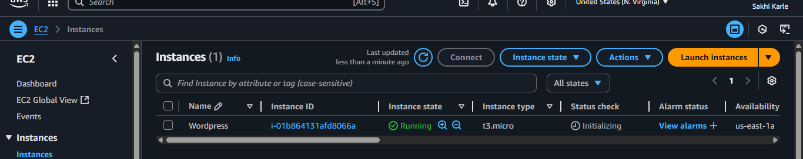

### * Step 2: Copy the ssh key and Connect to EC2 Instance

1.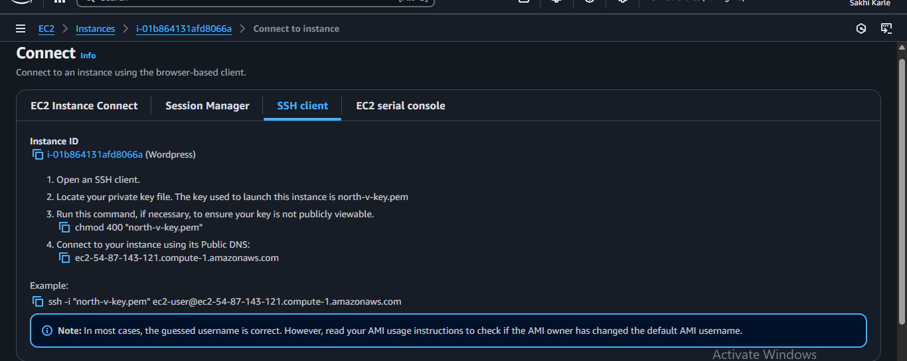 

2.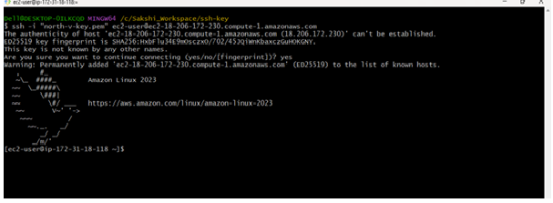

### * Step 3: Install LAMP Stack with Shell Script

#### 1. Create LAMP.sh file
  
    sudo vim LAMP.sh  

#### 2.Install LAMP
    sudo yum update  
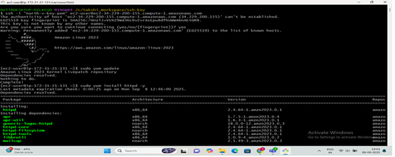    

    sudo yum install httpd mariadb105-server php -y

 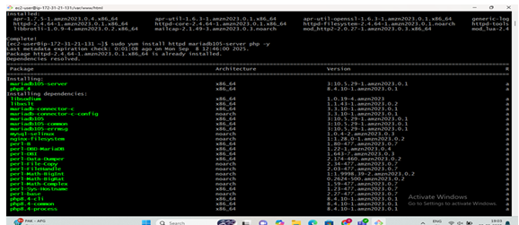

    sudo systemctl start httpd mariadb php-fpm
    sudo systemctl enable httpd mariadb php-fpm
    sudo systemctl status httpd mariadb php-fpm 

### Step 4: Install PHP Connector

    sudo yum install php8.4-mysqlnd.x86_64
  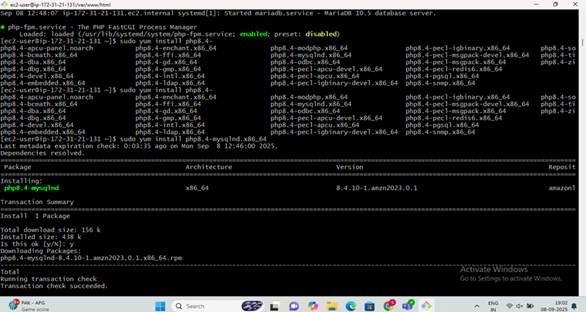  

 ### Step 5: Download and Extract Wordpress
    cd/var/www/html

  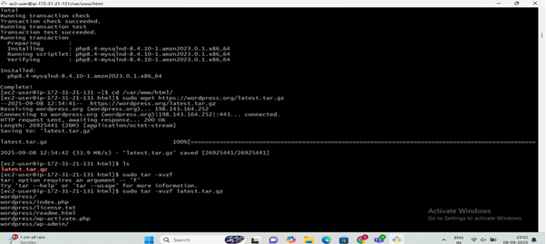

    sudo get https://wordpress.org/latest.tar.gz
    tar -xvzf <latest.tar.gz>
  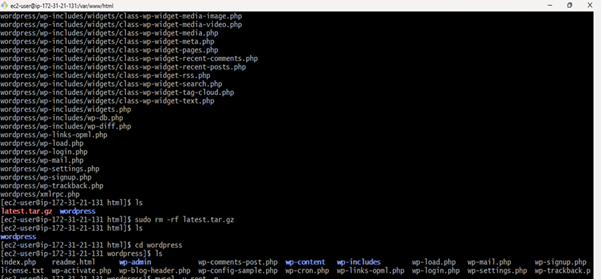
### Step 6: Create Wordpress database
1.Generate username and password

    sudo mysql
    alter user@localhot identified by 'root';
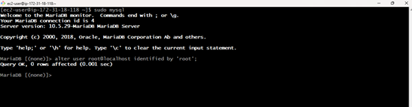

2.Login to Mysql (mariadb105-server) 

     sudo mysql -u root -p

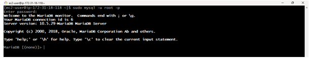

### Step 7: Create Database
    create database wordpressdb;
    show databases;
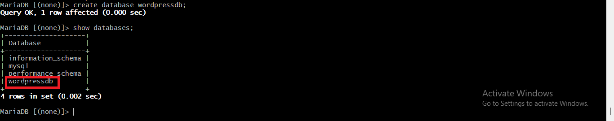

### Step 8: Grant permission to wordpress directory
    sudo chown -R apache:apache wordpress/
 ### Step 9: Paste the public IP in any browser   
 1. Click on let's go
 
2. Fill the information and click on submit
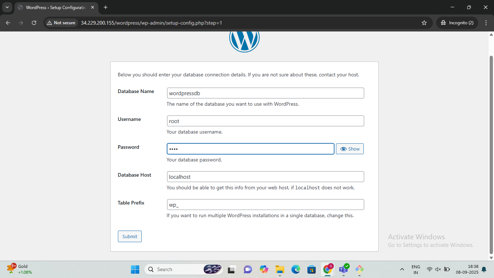
3. Run and Installation
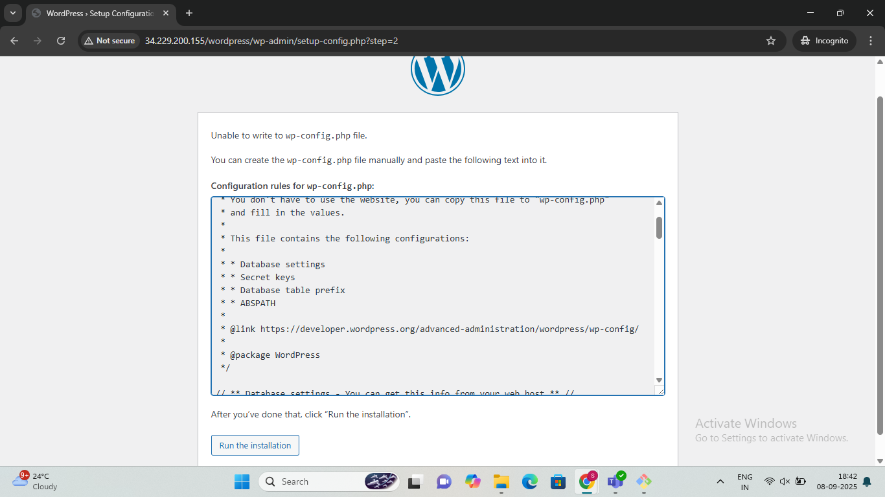
4. Fill the information and click on install wordpress
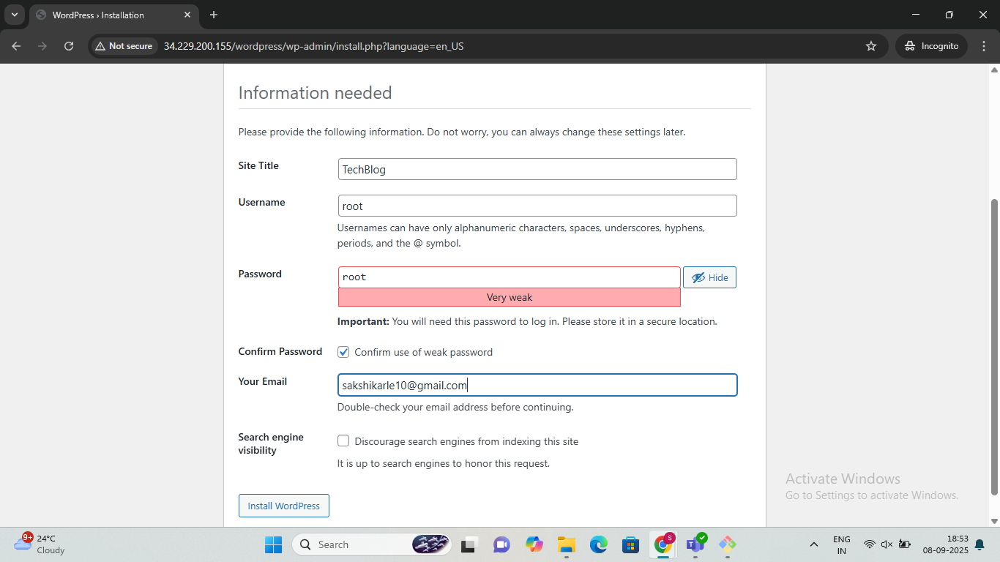
5. Login to wordpress
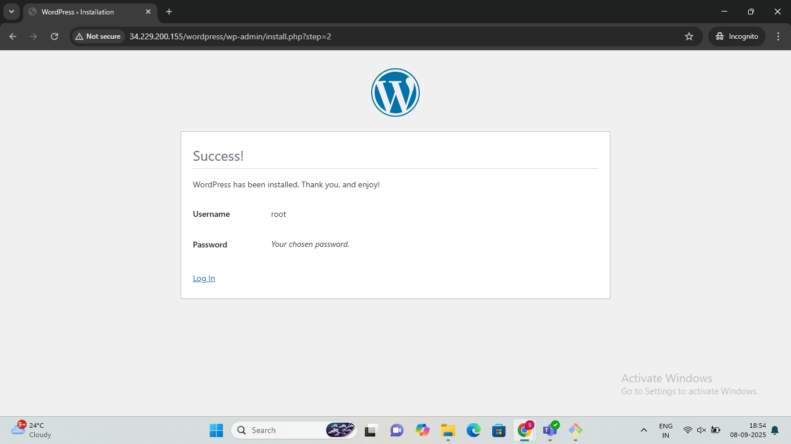

6. Deployed Wordpress Successfully
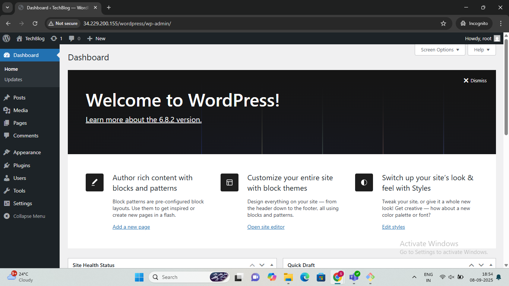

## Summary
This project explains how to deploy a wordpress website on an Amazon Linux EC2 instance using the LAMP stack.It walks through installing Apache, PHP, and MariaDB, downloading and configuring wordpress, setting up the database , and adjusting file permissions.
The result is a secure, production-ready wordpress site.